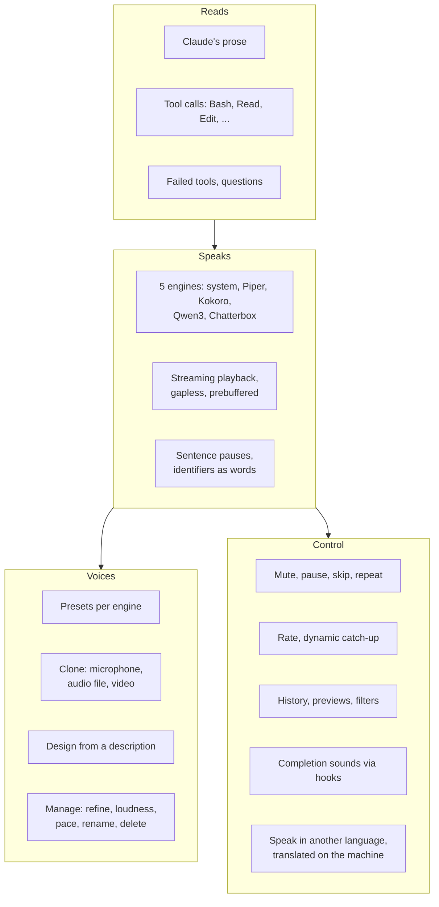
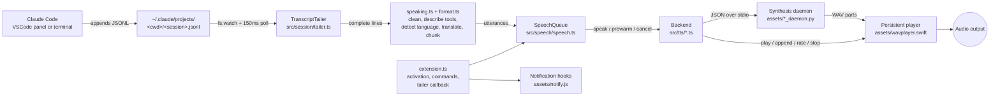
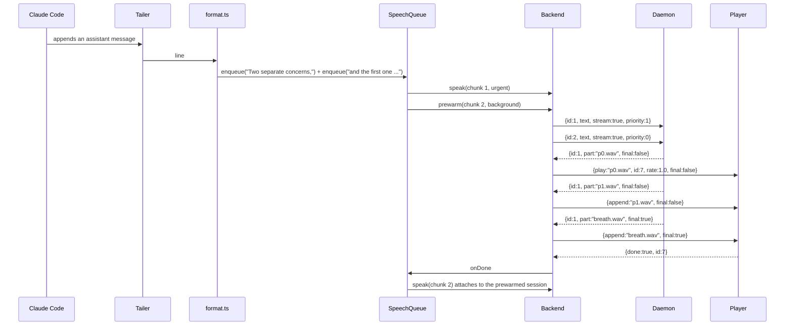
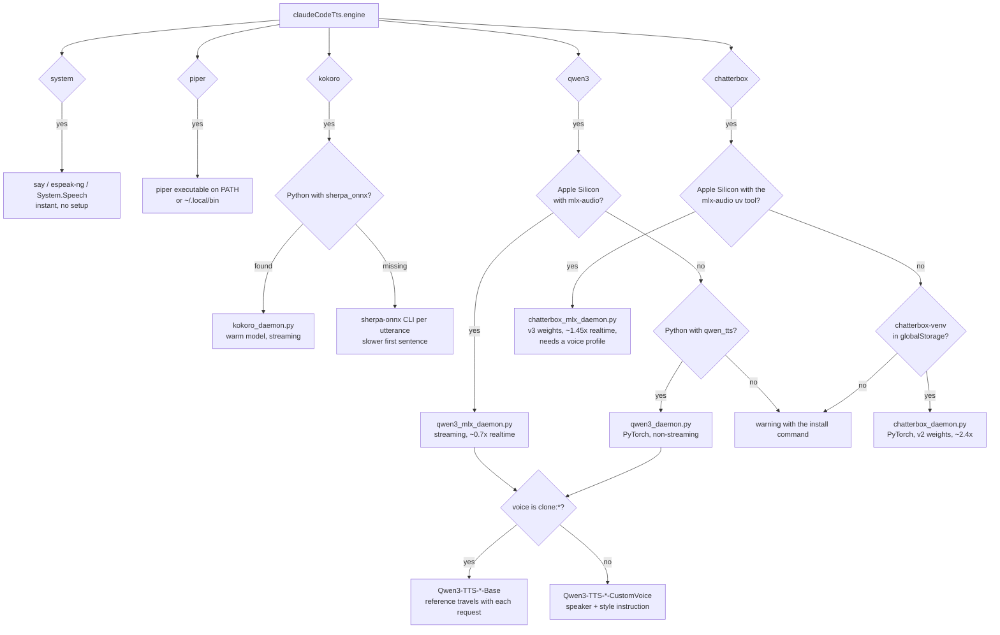
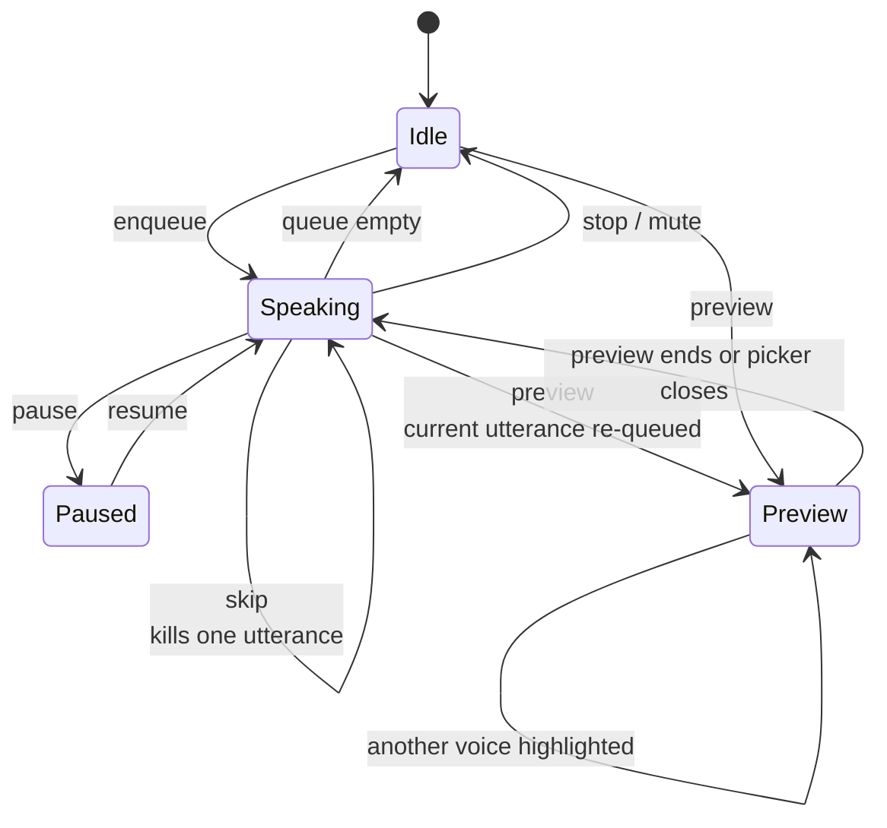
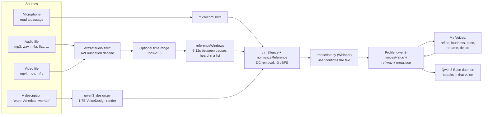
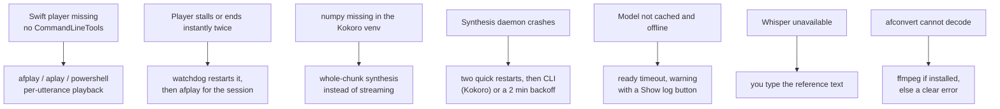
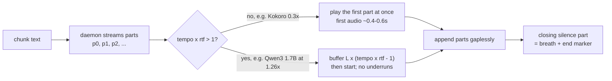
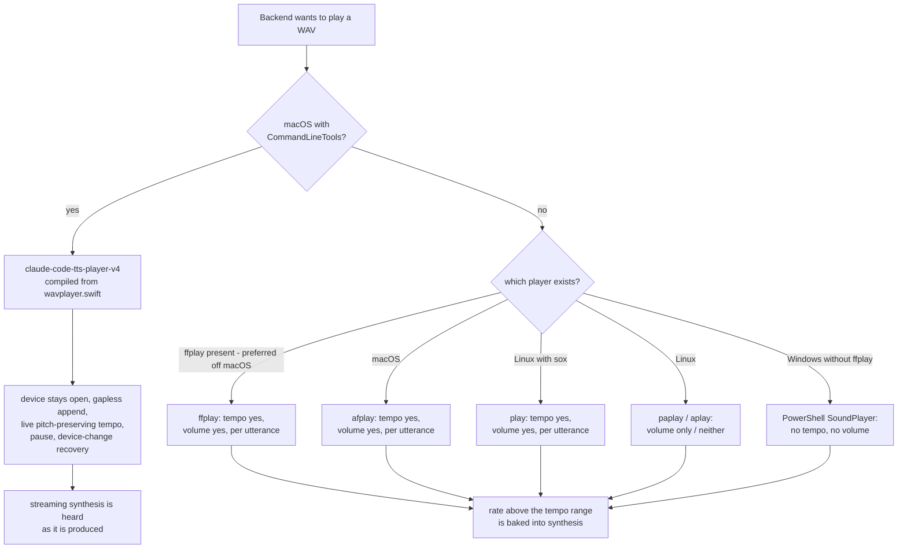
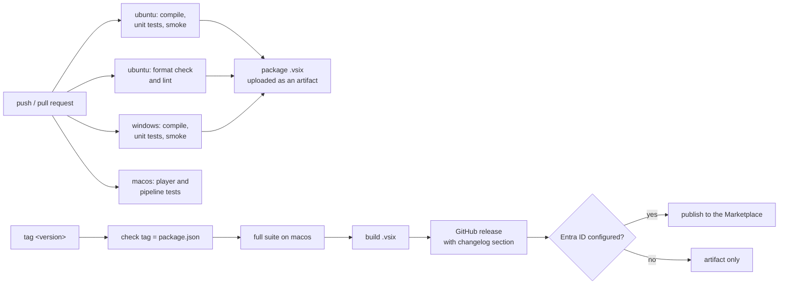

# Claude Code TTS: architecture

Claude Code TTS turns what Claude Code writes into speech, entirely on the machine it runs on. It has no runtime npm dependencies: the extension is TypeScript compiled to plain Node.js, plus small helpers (Python daemons, Swift tools) started as child processes that talk over stdin/stdout JSON. Nothing it speaks is ever sent anywhere: see [PRIVACY.md](PRIVACY.md).

## What it does



## Big picture



One utterance's life, in order:



## Which engine, which runtime

Resolution happens per backend construction; nothing is probed by importing Python at activation (that froze the editor), only by looking for files on disk.



## Speech queue states



## Where voices come from



## Degrading gracefully

Every optional piece has a fallback, so a missing tool never means silence.



## Streaming and prebuffering

Audio is consumed at `tempo` seconds per wall second and produced at `1/rtf`. When `tempo * rtf > 1` the player would run dry at every part boundary (the stutter), so the shortfall is buffered before playback starts. `rtf` is measured from the parts of each utterance, so a slow machine or a bigger model is accounted for automatically.



## Playback per platform



Streaming needs both a tempo-capable player and the persistent one, so today it is a macOS path; elsewhere each utterance is synthesized whole and then played. Engines with a native speed knob (Kokoro, Piper) still hit the requested rate exactly, because the rate is applied during synthesis rather than by time-stretching.

## Modules

| Area | Files | Responsibility |
|---|---|---|
| Activation | `src/extension.ts`, `src/core/runtime.ts` | Composition root: activate and deactivate, command registration, the transcript-tailer callback, session ownership and control wiring; the singletons live in `runtime.ts` |
| Settings | `src/core/config.ts`, `src/core/settingsMigration.ts` | The only reader of the configuration service (`config()`, `SETTING_KEYS`, `TUNING`, the per-voice rate), and the renames, merges and removals applied once at activation |
| UI | `src/ui/prompts.ts`, `src/ui/menus.ts`, `src/ui/voicePickers.ts`, `src/ui/statusBar.ts`, `src/ui/sounds.ts`, `src/ui/storageUi.ts` | Every menu, picker and prompt: `prompts.ts` is the kernel (`runMenu`, `pickWithBack`, `pickWithPreview`), the rest are the status bar menu and the lists behind it; voice rows audition on highlight |
| Text | `src/speech/format.ts` | Markdown to speech text (code, tables, URLs, images dropped; list items and headings end as sentences; identifiers split into words), tool announcements, lossless chunking with a fast-start clause split |
| Queue | `src/speech/speech.ts` | Sequential playback, coalescing, prewarm two ahead, catch-up rate per chunk, pause/resume, previews that re-queue the interrupted utterance |
| Engine contract | `src/tts/types.ts` | `Backend` (speak, prewarm, setLiveRate, cancel) and `Speaker` (kill, freeze, unfreeze) |
| Synth-then-play | `src/tts/synthPlay.ts` | Stream sessions, urgent vs background priority, prebuffer from the measured realtime factor, native speed vs time-stretch, temp-file hygiene |
| Engines | `src/tts/system.ts`, `piper.ts`, `kokoro.ts`, `qwen3.ts`, `chatterbox.ts` | OS voices; Piper CLI; Kokoro via sherpa-onnx; Qwen3 presets, clones and designed voices; Chatterbox cloned voices in 23 languages |
| Daemon bridge | `src/tts/pyDaemon.ts` | Spawns a Python daemon, ready timeout, request/cancel protocol, stderr to a log file |
| Player bridge | `src/tts/audio.ts` | Spawns and supervises the Swift player: stream ids, pause-aware watchdog, idle recycling, afplay fallback |
| Voices | `src/voices/clone.ts`, `src/voices/cloneFromFile.ts`, `src/voices/design.ts`, `src/ui/voiceManager.ts` | Record, import (audio or video, time range, candidate stretches auditioned in a list, Whisper transcript), design, manage and refine |
| Disk space | `src/platform/storage.ts`, `src/voices/backup.ts` | Measures the extension storage, the Hugging Face cache and the tool venvs; prunes what the settings do not need; exports and imports voice profiles as tar.gz |
| WAV tools | `src/tts/wav.ts` | Chunk-aware parsing, trimming, level normalization, reference window selection, extraction |
| Notifications | `src/setup/hooks.ts`, `src/setup/notifySetup.ts`, `assets/notify.js` | Claude Code hooks that play a system sound per event category |
| Session | `src/session/tailer.ts`, `src/session/sessionOwnership.ts`, `src/session/control.ts` | Tails `~/.claude/projects`, decides which window speaks a session (the oldest live window with that folder open, else the oldest live window), and reads one-word commands from `~/.claude/claude-code-tts-control` |
| Line to speech | `src/speech/speaking.ts`, `src/speech/utteranceFilter.ts`, `src/speech/spokenHistory.ts` | Clean, detect, translate, chunk and queue in order; ignored tools and tool-streak collapse; the last message and the 20 before it, for repeating |
| Language | `src/language/language.ts`, `src/language/translate.ts`, `src/language/glossary.ts`, `src/language/translationSetup.ts` | Script and language detection, Argos Translate over a Python daemon (best effort: the original is spoken when a model is missing), the terms kept in the source language, and the guided install of the runtime and one model per direction |
| Setup | `src/setup/setupFlows.ts`, `src/setup/diagnostics.ts`, `src/platform/uvBootstrap.ts` | Every guided install behind a modal that names the size, each through uv (the user's, or a private pinned copy under `<globalStorage>/uv`, SHA-256 verified), plus "Check Setup" |

## Helpers started as child processes

| Helper | Language | Started by | Purpose |
|---|---|---|---|
| `assets/wavplayer.swift` | Swift (AVAudioEngine) | `audio.ts`, compiled once into globalStorage/bin | Gapless streaming playback, live rate and volume, pause, device-change recovery, idle device release, underrun logging |
| `assets/kokoro_daemon.py` | Python (sherpa-onnx) | `kokoro.ts` | Kokoro synthesis, streaming per sentence with reader pauses, cancel, priority |
| `assets/qwen3_mlx_daemon.py` | Python (mlx-audio) | `qwen3.ts` on Apple Silicon | Qwen3 presets and clones on MLX, streaming, runaway cutoff, per-profile gain. Streaming primes the vocoder with the reference codes once per reference and restores that state before every stream, because a cold vocoder opens an octave high and settles over half a second. Clones go through the clone path directly with the daemon's repetition penalty (1.1; the public `generate()` forces 1.5, which measured flatter and noisier than the speaker) |
| `assets/qwen3_daemon.py` | Python (qwen-tts, PyTorch) | `qwen3.ts` elsewhere | Same protocol, non-streaming |
| `assets/chatterbox_mlx_daemon.py` | Python (mlx-audio) | `chatterbox.ts` on Apple Silicon | Chatterbox v3 cloning in 23 languages, runaway cutoff; the chunk about to play is streamed and chunks generated ahead stay whole (whole costs about 0.65x realtime against 1.1x streamed); also voice conversion (`{convert}` requests re-voice a WAV into a cloned voice through the S3 tokenizer and s3gen) |
| `assets/diacritize.py` | Python, imported by both Chatterbox daemons | the daemons, per request | vowel marks for the writing systems that omit them (Nakdimon, MIT) and spoken numbers (num2words) before generation. Where the vowels are not written the model guesses them and says other words: CER 0.294 becomes 0.076. Identifiers, versions and `file:line` references are left as written. Degrades to the original text when the packages are absent, and the engine says so once and offers to install them: the runtime is the same `mlx-audio` tool the Qwen3 setup installs, so an engine that works at all is not evidence that these are there |
| `assets/speech_budget.py` | Python, imported by every generator | the daemons and the voice designer | How long text takes to say, which is the runaway cutoff. Counts Chinese, Japanese and Korean by character: they are written without spaces, so counting words scored a passage as one and cut the speech off after a second. One module because that fix had to be made three times and still missed a fourth copy |
| `assets/chatterbox_daemon.py` | Python (chatterbox-tts, PyTorch) | `chatterbox.ts` elsewhere | Same protocol, v2 weights (the PyPI package cannot load v3) |
| `assets/qwen3_design.py` | Python | `voices/design.ts`, `ui/voiceManager.ts` | One-shot VoiceDesign render of the reference passage |
| `src/setup/uninstallHook.ts` | TypeScript, no vscode import | VSCode, as the `vscode:uninstall` script, on the start after an uninstall | Removes the hook entries, sound choices and window registry under `~/.claude` |
| `assets/transcribe.py` | Python (Whisper: MLX where the Python has it, transformers where it has torch) | clone flows | Transcript of a reference recording |
| `assets/translate_daemon.py` | Python (argostranslate) | `language/translate.ts` | Local translation, OpenNMT models. Same line protocol plus `op` requests: `packages` lists installed directions, `install` downloads one. Translations cached per pair, model kept loaded; a failure means the original text is spoken |
| `assets/micrecord.swift` | Swift (AVAudioRecorder) | `voices/clone.ts` | Microphone capture to WAV, 24kHz mono 16-bit |
| `assets/extractaudio.swift` | Swift (AVFoundation) | `voices/cloneFromFile.ts` | Audio track of video/audio files to 24kHz mono WAV, optional time range |

## Stdio protocols

Daemons (one JSON object per line):

```
-> {"id": 1, "text": "...", "sid": 3, "speed": 1.0, "out": "/tmp/x.wav", "stream": true, "priority": 1}
   Qwen3 clone requests may carry their own "ref_audio" / "ref_text" / "gain":
   any voice on the same checkpoint is then synthesized without a reload,
   which is what makes auditioning and switching cloned voices instant.
<- {"id": 1, "part": "/tmp/x.p0.wav", "final": false}   (repeated, one per sentence or chunk)
<- {"id": 1, "part": "/tmp/x.p4.wav", "final": true}    (short silence: breath + end marker)
<- {"id": 1, "ok": true}                                 or {"id": 1, "ok": false, "error": "..."}
-> {"cancel": 1}                                         aborts a queued or running request
```

Player:

```
-> {"play": "/a.wav", "id": 7, "rate": 1.2, "volume": 0.9, "final": false}
-> {"append": "/b.wav", "final": true}
-> {"rate": 1.5}  {"volume": 0.5}  {"pause": true}  {"resume": true}  {"stop": true}
<- {"done": true, "id": 7}   {"done": true, "id": 7, "stopped": true}   {"done": false, "id": 7, "error": "..."}
```

Every reply carries the stream id it refers to: a stop followed immediately by a new play must not complete the new stream with the old one's reply.

## External dependencies

No engine is bundled: each is downloaded by a guided setup behind a modal that names the size, or found on disk when the user installed it themselves. The only bundled audio is the 9 preset voice samples (`assets/voice-samples/*.wav`) used for auditioning.

| Dependency | Used for | How it gets there | License |
|---|---|---|---|
| macOS `say`, `espeak-ng`, Windows `System.Speech` | System engine | Part of the OS | OS |
| [sherpa-onnx](https://github.com/k2-fsa/sherpa-onnx) binaries + Kokoro v1.0 model (~360 MB) | Kokoro engine | "Set Up Kokoro Engine" downloads into globalStorage | Apache-2.0 |
| Python `sherpa-onnx` package (+ numpy) | Kokoro daemon (streaming, warm model) | `uv tool install --with numpy sherpa-onnx` (optional) | Apache-2.0 |
| Python `chatterbox-tts` or `mlx-audio` | Chatterbox daemon (cloned voice in 23 languages) | `uv tool install mlx-audio` on Apple Silicon, else a virtualenv the extension builds (optional) | MIT |
| Python `nakdimon` (pinned 0.2.1), `num2words` | vowel marks for the writing systems that omit them and spoken numbers for the Chatterbox daemons; installed alongside them | with the Chatterbox setup (optional) | MIT; LGPL-2.1 (used unmodified, in its own process) |
| `uv` (the user's, or a private copy under `<globalStorage>/uv`) | Installs every Python engine and translation into isolated tool environments, with a managed Python when the machine has none | Downloaded by the extension on first setup when absent (pinned release, SHA-256 verified); `src/platform/uvBootstrap.ts` | MIT / Apache-2.0 |
| [mlx-audio](https://github.com/Blaizzy/mlx-audio) + `mlx-community/Qwen3-TTS-*` | Qwen3 on Apple Silicon | `uv tool install mlx-audio`; models from Hugging Face on first use | MIT / Apache-2.0 |
| [qwen-tts](https://github.com/QwenLM/Qwen3-TTS) (PyTorch) | Qwen3 elsewhere; Whisper via its `transformers` and torch | `uv tool install qwen-tts` | Apache-2.0 |
| `mlx-community/whisper-small*-asr-fp16`, or `openai/whisper-small*` where transcription runs on torch | Reference transcripts | Downloaded on first clone (485 MB on MLX, 967 MB on torch) | MIT |
| Argos Translate (OpenNMT models) | Speaking in a language other than the one Claude wrote in | "Set Up Translation": `uv tool install argostranslate`, then one model per direction (~100 MB) from the Argos index | models per pair, mostly CC-BY-SA |
| [Piper](https://github.com/OHF-Voice/piper1-gpl) + `rhasspy/piper-voices` | Piper engine | `uv tool install piper-tts` from "Download Piper Voice", which also fetches the voice model | GPL-3.0, per-voice |
| Xcode CommandLineTools (`swiftc`) | Compiling the Swift helpers once | User-installed; afplay fallback without it | Apple |
| `afconvert`, `ffmpeg` (optional) | Audio conversion fallbacks | OS / user | - |

Dev dependencies: TypeScript, Prettier, ESLint (with typescript-eslint, @stylistic and eslint-config-prettier), `@vscode/vsce`, `@types/node`, `@types/vscode`. Tests use Node's built-in `node:test`.

## Data on disk

```
<globalStorage>/                       macOS: ~/Library/Application Support/Code/User/globalStorage/giladreich.claude-code-tts
                                       Linux: ~/.config/Code/User/globalStorage/...   Windows: %APPDATA%\Code\User\globalStorage\...
  bin/claude-code-tts-player-v4           compiled Swift helpers
  bin/claude-code-tts-mic-v1, claude-code-tts-extract-v1
  kokoro/                              sherpa-onnx runtime + Kokoro model
  piper-voices/*.onnx(.json)
  qwen3-voices/<slug>/ref.wav          cloned / designed voice profiles
  qwen3-voices/<slug>/meta.json        name, refText, gain, pace, designed, description, source
  chatterbox-venv/                     Chatterbox PyTorch runtime (off Apple Silicon)
  uv/                                  the private uv, its Python, its tool venvs and cache
  player.log, kokoro-daemon.log, qwen3-daemon.log, qwen3-design.log, chatterbox-daemon.log, translate-daemon.log
  claude-code-tts-notify.js               hook script (version-stable path)
~/.claude/claude-code-tts-notify.json     per-category notification sounds
~/.claude/settings.json                hook entries (only ours are touched; backup kept)
~/.cache/huggingface/hub/              Qwen3, Chatterbox, VoiceDesign and Whisper models
~/.local/share/argos-translate/        translation models, one per direction
~/.claude/claude-code-tts-windows/        one heartbeat file per window (which window speaks which session)
~/.claude/claude-code-tts-control         one-word commands (mute, pause, skip, ...)
$TMPDIR/claude-code-tts-*.wav             in-flight audio parts (removed after playback)
```

Sizes in practice: a Qwen3 0.6B checkpoint 2.3 GB (1.7B: 4.2 GB), Chatterbox weights ~3 GB on MLX or ~2.5 GB on PyTorch (a machine that tried both keeps both), Kokoro runtime plus model ~400 MB, a Piper voice 60-120 MB, a Whisper small 485 MB in the MLX build (967 MB in the transformers build), a voice profile ~0.5 MB. "Storage and Cleanup" (`src/platform/storage.ts`) measures each of these, marks the ones the current settings load, and removes only what is selected; profiles are excluded from bulk actions because they cannot be fetched again.

## Speed model

- Kokoro and Piper synthesize the requested rate natively (`nativeSpeed`); playback tempo only carries live adjustments, so the timbre never shifts with the rate.
- Qwen3 has no speed knob: natural-pace synthesis, pitch-preserving time-stretch in the player, prebuffered as described above.
- Catch-up (queue backlog) changes the rate only between chunks, starts only past a real backlog (three sentences or 600 characters waiting), and moves at most 4% of the base rate per chunk in either direction (`steppedRate`); an explicit rate change applies instantly to the playing audio.
- A tempo within 3% of 1 is played at exactly 1 (`playbackTempo`), and the player then bypasses its time-pitch unit instead of running it at unity. A phase vocoder colours what it passes: at 1.02x, measured, it overshot a full-scale utterance to 1.36 (+2.7 dB) and the output clipped, the first time 0.19s in.
- The neural daemons leave headroom (`soft_limit`: untouched below 0.7, a tanh knee up to the 0.89 ceiling): the codec decoder saturates at full scale and the time-stretch overshoots what it is given, so audio delivered at 0 dBFS clips on the way out. The knee matters: a tanh over the whole signal measured 3.6% harmonic distortion on a 0.6 sine and 6% on 0.8.

## Tests and CI

`npm run verify` is the gate before anything is called done: `format:check` (Prettier), `lint` (ESLint), `compile` (tsc), then `npm test`; `vscode:prepublish` runs the same chain, so packaging cannot ship unformatted or unlinted code. `npm test` = `node --test` over `test/unit` and `test/integration` (sequential) plus `test/activate-smoke.js`. Unit tests are pure or use fake model modules on `PYTHONPATH` and run on every platform; the integration tests compile the Swift helpers and play silently through CoreAudio, so they cover the macOS playback path only and skip themselves elsewhere. CI runs format and lint in their own job (seconds, nothing to install), the unit suite on Linux and Windows (where the drive-letter scoping, hook matching, venv layout and sound library differ) and the integration suite on macOS, and packages the .vsix only after style, unit and windows pass.


