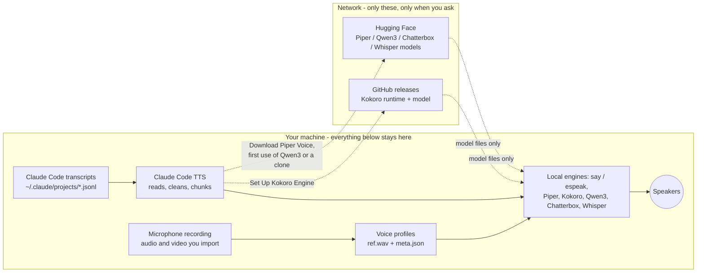

# Privacy: everything runs on your machine

Claude Code TTS is a local text-to-speech front end for Claude Code. **Nothing it speaks, records, or clones is ever sent anywhere.** There is no cloud TTS, no telemetry, no analytics, no accounts, no API keys, and no "anonymous usage data". The extension has no runtime npm dependencies, so there is no third-party SDK that could phone home either.

## What crosses the machine boundary, and what never does



Never leaves the machine: the text Claude writes, the text spoken, tool names and commands, file paths, microphone recordings, imported audio or video, voice references and profiles, synthesized audio, translations, settings, and logs.

## Every network access in the extension, exhaustively

Six URLs exist in the entire source tree: four things to download, and two documentation links that open in your browser only if you click them. You can confirm this yourself:

```
grep -rnE "https?://|fetch\(|XMLHttpRequest|socket\." src assets --include="*.ts" --include="*.js" --include="*.py" --include="*.swift"
```

| When | What is requested | What is sent | Avoidable? |
|---|---|---|---|
| You run "Set Up Kokoro Engine" | `github.com/k2-fsa/sherpa-onnx/releases/...` runtime and model archives (~360 MB) | An ordinary file GET. No identifiers, no content. | Yes: use another engine, or place the files in the extension's storage yourself |
| You run "Download Piper Voice" | `huggingface.co/rhasspy/piper-voices/...` the model you picked | A file GET | Yes: point `claudeCodeTts.piper.voice` at a model you already have |
| First use of Qwen3, a clone, or "Design a Voice from a Description" | Hugging Face model weights, downloaded by the Python library (`mlx-audio` / `qwen-tts`): about 2.3 GB for the speaking model, about 4.2 GB for the design model | A file GET | Yes: pre-download once; afterwards the daemon loads from the local snapshot with no network call at all |
| First use of Chatterbox | Hugging Face model weights (`mlx-community/chatterbox-multilingual-v3` plus its speech tokenizer, or `ResembleAI/chatterbox`), about 3 GB | A file GET | Yes: pre-download once; afterwards it loads from the local snapshot. Its PerTh watermark is computed locally and makes no network call |
| Setting up Chatterbox, or accepting the offer to add text preparation before a writing system that needs it is spoken or recorded | The `nakdimon` and `num2words` packages from PyPI, about 50 MB, which restore the vowel marks that some writing systems leave out | File GETs through uv | Yes: decline the offer. Without them those languages are spoken from guessed vowels, which is other words rather than a worse accent |
| Setting up Qwen3, Chatterbox, Piper or translation | The engine's Python package from PyPI, installed by uv: `piper-tts`, `mlx-audio` or `qwen-tts`, `argostranslate`, or off Apple Silicon an isolated `chatterbox-tts` environment of about 1 GB. If you have no `uv` of your own, first `github.com/astral-sh/uv/releases`: the uv tool at a pinned version, plus the `.sha256` the project publishes beside it, then a managed Python (python-build-standalone on GitHub) | File GETs. The uv archive is verified against the published SHA-256 before it is unpacked; a mismatch is refused | Yes: install the packages yourself, and install `uv` yourself so the extension uses that one, in your own tool directory |
| First voice clone | A Whisper small model (485 MB in the MLX build, 967 MB where transcription runs on torch), English-only or multilingual to match the reference, used to transcribe *your* recording locally | A file GET for the model. **Your recording is not uploaded**; transcription runs on this machine | Yes: skip it and type the reference text |
| You set up translation | An Argos Translate model for the language pair (~100 MB) from the Argos model index | A file GET for the model. **The text being translated never leaves the machine**; translation runs locally | Yes: leave `claudeCodeTts.speakLanguage` empty |
| You click a "how to install" link | Opens `github.com/OHF-Voice/piper1-gpl` in your browser | Only if you click | Yes |
| Claude Code is not installed and you click the offer to read about it | Opens `claude.com/claude-code` in your browser | Only if you click | Yes |

That is the complete list. Everything else, including all synthesis, cloning, transcription and playback, is local computation. The downloads the extension makes itself go through the proxy VSCode is configured for (its `http.proxy` setting) or the one in `HTTPS_PROXY`, so a proxy sees them the way it sees any other download; the Python runtimes honour the same variables.

## About Claude Code itself

Claude Code talks to Anthropic to do its work; that is the agent, not this extension. Claude Code TTS only reads the transcript files Claude Code has already written to your disk, and adds **no** outbound traffic of its own. Turning off Claude Code TTS does not change what Claude Code sends, and turning it on does not send anything extra.

## The control file

`~/.claude/claude-code-tts-control` is read, never written, and only ever
interpreted as one of a fixed list of words (mute, skip, stop and a few
more). Nothing in it is executed, and a line that is not one of those words
is ignored. It exists so the voice can be stopped from a terminal without
switching windows; delete the file if you do not want it, and nothing
recreates it.

## Microphone, files, and video

- The microphone is used only while you are recording a voice clone: on macOS a bundled helper (`assets/micrecord.swift`), elsewhere `ffmpeg` through the platform's capture backend (DirectShow on Windows, PulseAudio or ALSA on Linux). Either way it writes a local WAV. macOS asks for permission once.
- Imported audio and video are decoded locally (`assets/extractaudio.swift`, AVFoundation; `afconvert` or `ffmpeg` as fallbacks). Only the ~10 second reference stretch you approve is kept: the decoded working copy the picker cuts candidates from (`<globalStorage>/qwen3-voices/.import-*.wav`) is deleted when the flow ends, whether you finish or cancel. The file you chose is never modified or uploaded.
- Transcription of your reference uses a local Whisper model in your own Python environment.

## What is written to disk, and how to remove it

`<globalStorage>` is `~/Library/Application Support/Code/User/globalStorage/giladreich.claude-code-tts` on macOS, `~/.config/Code/User/globalStorage/...` on Linux, and `%APPDATA%\Code\User\globalStorage\...` on Windows.

| Path | Contents |
|---|---|
| `<globalStorage>/qwen3-voices/<slug>/` | Your cloned and designed voices: `ref.wav`, `meta.json` |
| `<globalStorage>/qwen3-voices/.trash/` | Voices you deleted, until you empty the trash in "Storage and Cleanup" |
| `<globalStorage>/kokoro/`, `piper-voices/` | Downloaded engines and voice models |
| `<globalStorage>/uv/` | The private copy of uv, the Python it manages, and every package installed through it. Only exists if you had no `uv` of your own |
| `<globalStorage>/chatterbox-venv/` | The Chatterbox PyTorch environment, about 1 GB, off Apple Silicon only |
| `$HF_HOME/hub`, otherwise `~/.cache/huggingface/hub` | Model weights the Python runtimes download: Qwen3, Chatterbox, Whisper. Outside the extension's storage, listed and removable in "Storage and Cleanup" |
| `~/.local/share/argos-translate` | Translation models, about 100 MB per language pair. Also outside the extension's storage |
| `<globalStorage>/bin/` | The Swift helpers compiled on this machine |
| `<globalStorage>/*.log` | Diagnostics: playback timings and daemon stderr. The Qwen3 and Chatterbox daemons log the first 40 characters of each sentence they synthesize (60 when a runaway generation is cut), so these files hold short excerpts of what was spoken. Nothing is sent anywhere, and "Storage and Cleanup" deletes them |
| VSCode global state | The last 20 spoken messages, for "Recent Messages" |
| `~/.claude/claude-code-tts-notify.json` | Notification sound choices (only if you enable completion sounds) |
| `~/.claude/claude-code-tts-control` | Read only, and only if you create it: one word telling the voice to mute, skip or stop |
| `~/.claude/claude-code-tts-windows/` | One small file per open VSCode window (its id, its process id, its open folders, a heartbeat) so that only one window speaks a session. Shared with other VSCode builds for the same reason; removed when a window closes |
| `~/.claude/settings.json` | Hook entries pointing at the bundled notify script, which is copied to `<globalStorage>/claude-code-tts-notify.js`. Only our own entries are touched, and `~/.claude/settings.json.claude-code-tts-backup` is written before the first change and kept |
| `$TMPDIR/claude-code-tts-*.wav` | Audio parts in flight, deleted after playback (stale files are swept after 10 minutes) |
| `<globalStorage>/played/` | The last minutes of spoken audio (the `export.keepMinutes` setting: 30 by default, `0` keeps nothing and removes what was kept), one WAV per sentence plus an index per window with the text each sentence was made from, so "Export Spoken Audio to a File" can write what was heard. Oldest out first; "Storage and Cleanup" removes it, and so does a settings reset |
| An audio export you create | Wherever you save it: what was spoken, as a listenable file |
| A voice backup you create | Wherever you save it: contains the reference recording and its transcript, so treat it like the original recording |

"Storage and Cleanup" shows the size of each of these and removes what you choose, entirely locally. Uninstalling the extension makes VSCode delete its globalStorage folder on the next start, voices included (back them up first), and runs the extension's uninstall script, which removes its hook entries from `~/.claude/settings.json`, `~/.claude/claude-code-tts-notify.json` and `~/.claude/claude-code-tts-windows/`; the settings backup and your `claudeCodeTts.*` settings in VSCode's own settings.json are left, as VSCode leaves every extension's. "Remove Everything Claude Code TTS Added" (Menu, Setup and diagnostics) does all of that from inside the extension, plus the models, runtimes, logs and settings, with a voice backup offered first. The weights the Python runtimes download live in the Hugging Face cache (`$HF_HOME/hub`, otherwise `~/.cache/huggingface/hub`) and the translation models in `~/.local/share/argos-translate`; that same screen lists and deletes both, and lists the uv tool directories it does not own with the command that removes them. "Toggle Completion Sounds" removes the hook entries it added. "Recent Messages" history and the spoken audio kept for export are cleared by "Reset Settings to Defaults" plus uninstalling.

## Verifying it yourself

- **Run it offline.** Once the engine and voices are downloaded, disconnect the network: speech, cloning from a file, and voice design (with the model cached) all keep working. Only new downloads fail.
- **Watch the process.** A network monitor (Little Snitch, `lsof -i`, `nettop`) shows the extension host making no connections while speaking.
- **Read the code.** `src/tts/net.ts` is the only HTTP client, and it is imported by exactly four files: `src/setup/kokoroSetup.ts` and `src/setup/piperSetup.ts` (both behind an explicit user action with a consent dialog that states the size), `src/platform/uvBootstrap.ts`, which downloads a pinned release of `uv` and refuses to unpack it unless it matches the SHA-256 that project publishes, and `src/extension.ts`, which only hands it VSCode's `http.proxy` setting at activation and downloads nothing.
